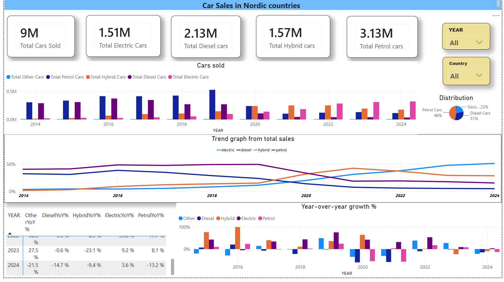

# Nordic New-Car Sales by Fuel Type

Analysis of new passenger car registrations in the Nordic countries using data from the EU statistics portal (Eurostat), comparing electric, hybrid, petrol, diesel and other fuel types over time.

## Dashboard

## What I did
- Cleaned the raw file in Excel: removed blank rows and fixed inconsistent formatting
- Continued in SQL Server: replaced missing-value markers with NULL/0, trimmed spaces, converted text columns to numbers
- Wrote queries for totals and shares of each fuel type by country and year
- Built a Power BI dashboard showing sales by fuel type, distributions and changes over time

## Files
- `NewCarQuery.sql` – cleaning and analysis queries
- `PowerBI+ExcelLink` – link to the Power BI and Excel files

## Tools
Excel, SQL Server (SSMS), Power BI
